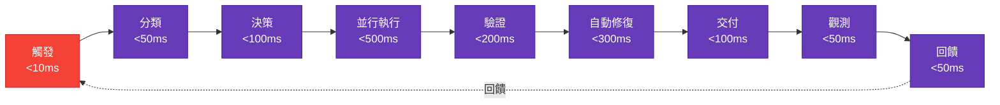
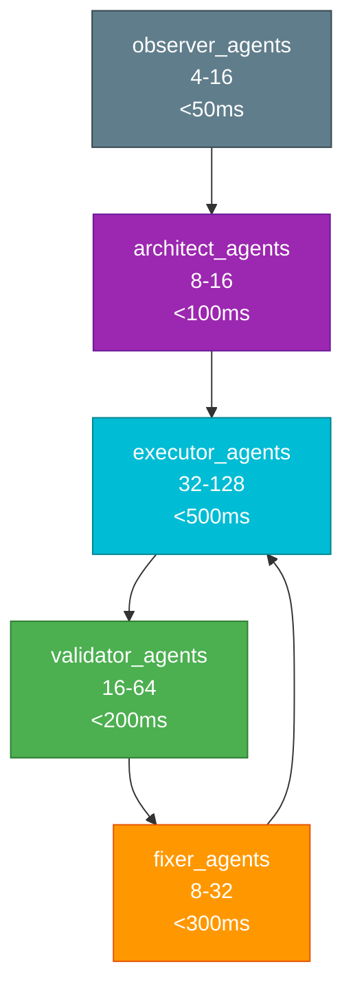
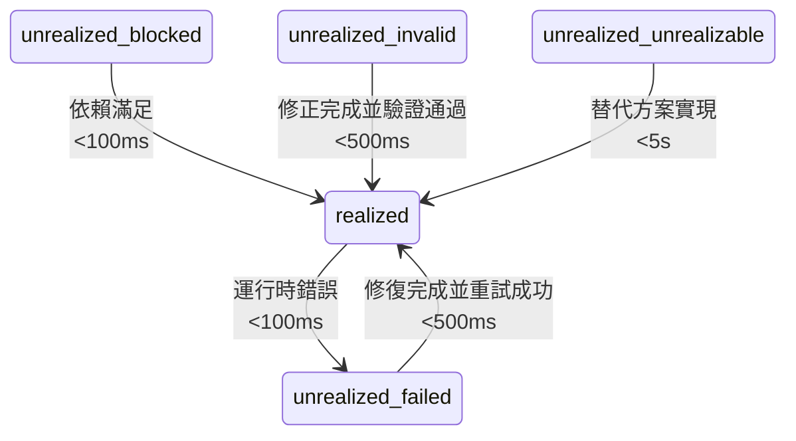

# @ECO-governed
# @ECO-layer: GL90-99
# @ECO-semantic: documentation
# @ECO-audit-trail: ../../engine/governance/GL_SEMANTIC_ANCHOR.json
#
# GL Unified Architecture Governance Framework Activated
# INSTANT Execution DAG 報告

自動生成於 INSTANT-EXECUTION-MANIFEST.yaml

## 1. 事件驅動 DAG

## 2. 閉環流水線 DAG

## 3. 代理協作 DAG

## 4. 狀態轉換 DAG

