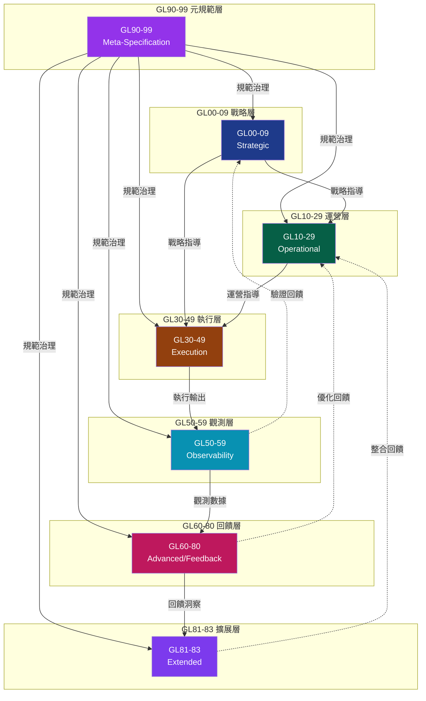

# @ECO-governed
# @ECO-layer: GL90-99
# @ECO-semantic: documentation
# @ECO-audit-trail: ../../engine/governance/GL_SEMANTIC_ANCHOR.json
#
# GL Unified Architecture Governance Framework Activated
# @ECO-governed
# @ECO-layer: GL90-99
# @ECO-semantic: documentation
# @ECO-audit-trail: ../../engine/governance/GL_SEMANTIC_ANCHOR.json
#
# GL Unified Architecture Governance Framework Activated
# GL DAG - 治理層級有向無環圖

## 圖形視覺化

## 拓撲排序

| 順序 | 層級 | 名稱 |
|------|------|------|
| 1 | GL90-99 | Meta-Specification Layer |
| 2 | GL00-09 | Strategic Layer |
| 3 | GL10-29 | Operational Layer |
| 4 | GL30-49 | Execution Layer |
| 5 | GL50-59 | Observability Layer |
| 6 | GL60-80 | Advanced/Feedback Layer |
| 7 | GL81-83 | Extended Layer |

## 鄰接矩陣

|         | GL90-99 | GL00-09 | GL10-29 | GL30-49 | GL50-59 | GL60-80 | GL81-83 |
|---------|---------|---------|---------|---------|---------|---------|---------|
| GL90-99 | 0       | 1       | 1       | 1       | 1       | 1       | 1       |
| GL00-09 | 0       | 0       | 1       | 1       | 0       | 0       | 0       |
| GL10-29 | 0       | 0       | 0       | 1       | 0       | 0       | 0       |
| GL30-49 | 0       | 0       | 0       | 0       | 1       | 0       | 0       |
| GL50-59 | 0       | 0       | 0       | 0       | 0       | 1       | 0       |
| GL60-80 | 0       | 0       | 0       | 0       | 0       | 0       | 1       |
| GL81-83 | 0       | 0       | 0       | 0       | 0       | 0       | 0       |

## 邊定義

### 主要依賴 (實線)

| 邊 ID | 上游 | 下游 | 類型 |
|-------|------|------|------|
| E001 | GL90-99 | GL00-09 | 規範治理 |
| E002 | GL90-99 | GL10-29 | 規範治理 |
| E003 | GL90-99 | GL30-49 | 規範治理 |
| E004 | GL90-99 | GL50-59 | 規範治理 |
| E005 | GL90-99 | GL60-80 | 規範治理 |
| E006 | GL90-99 | GL81-83 | 規範治理 |
| E007 | GL00-09 | GL10-29 | 戰略指導 |
| E008 | GL00-09 | GL30-49 | 戰略指導 |
| E009 | GL10-29 | GL30-49 | 運營指導 |
| E010 | GL30-49 | GL50-59 | 執行輸出 |
| E011 | GL50-59 | GL60-80 | 觀測數據 |
| E012 | GL60-80 | GL81-83 | 回饋洞察 |

### 回饋迴路 (虛線)

| 邊 ID | 上游 | 下游 | 類型 |
|-------|------|------|------|
| E013 | GL50-59 | GL00-09 | 驗證回饋 |
| E014 | GL60-80 | GL10-29 | 優化回饋 |
| E015 | GL81-83 | GL10-29 | 整合回饋 |

## DAG 驗證

| 規則 | 狀態 |
|------|------|
| DAG-001 無循環驗證 | ✅ PASS |
| DAG-002 層級完整性 | ✅ PASS |
| DAG-003 依賴方向性 | ✅ PASS |
| DAG-004 節點唯一性 | ✅ PASS |